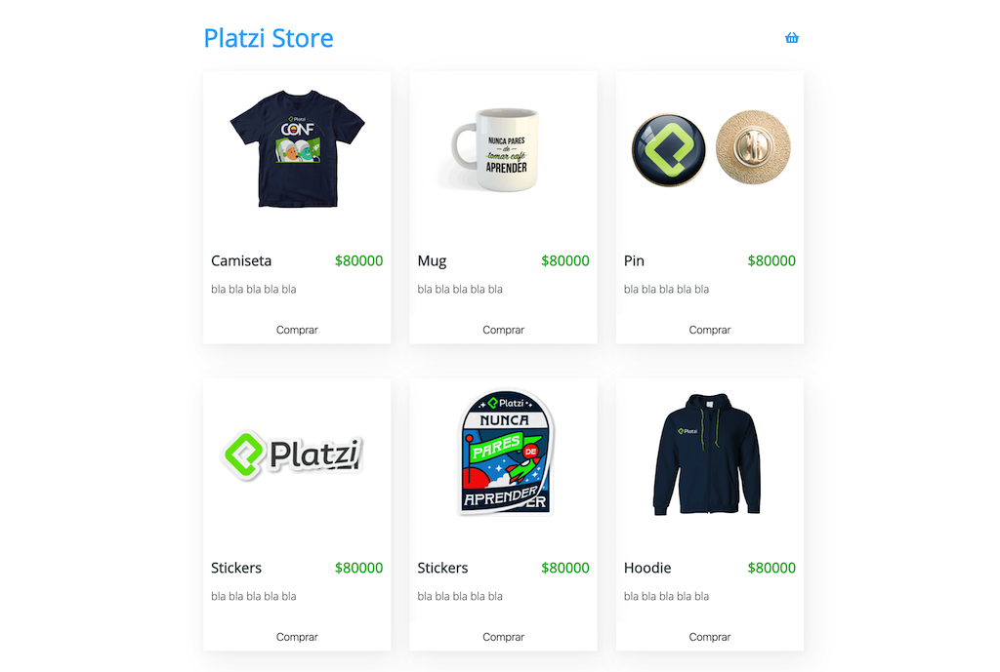

# Test Course with React

Sample project for testing with Jest and Enzyme.

# How it works
- `npm install` to install dependencies.
- `npm start` to use dev environment.
- `npm test` to run all tests.

## Licencia

MIT
